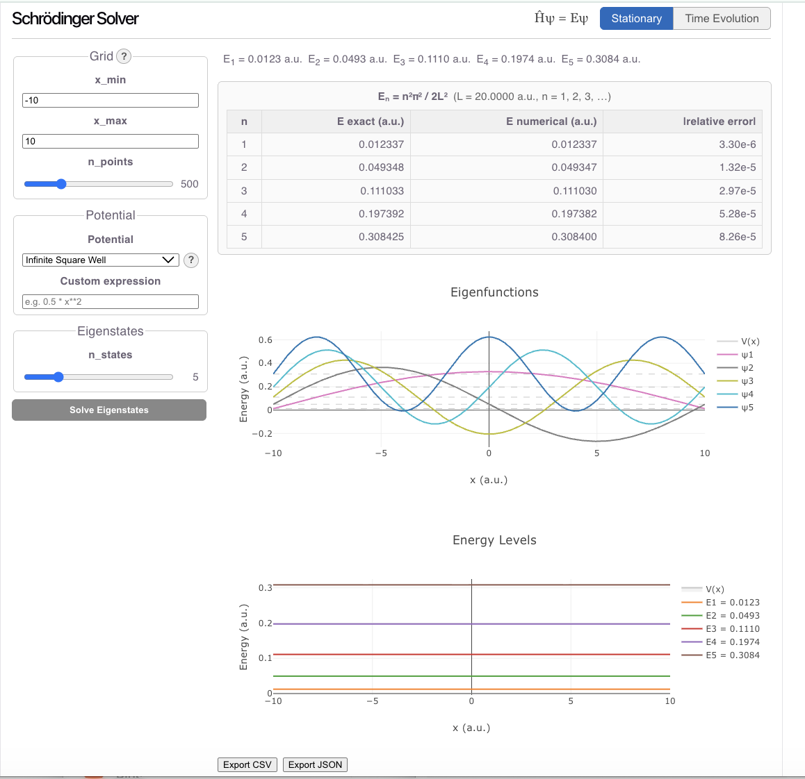

# Schrödinger Solver

A browser-based solver for the one-dimensional time-dependent and time-independent Schrödinger equation. Run the backend and frontend locally, then open the browser, choose a potential, and explore.



---

## Features

**Stationary mode** — solve for energy eigenstates:
- Seven built-in potentials: infinite square well, harmonic oscillator, double well, deep double well, finite square well, step potential, Gaussian barrier
- Adjustable parameters (barrier height, well separation, …) via sliders for each potential
- Custom potential via a safe math expression (e.g. `0.5*x**2 + 0.1*x**4`)
- Eigenfunctions plotted offset by energy (standard physics convention)
- Exact-solution comparison table for infinite square well and harmonic oscillator: numerical energies vs analytic values with relative error
- Physics reference modal (? button) for each potential: Hamiltonian, key formula, description, and what to look for

**Time-evolution mode** — evolve a Gaussian wave packet under the chosen potential:
- Crank-Nicolson integrator — unconditionally stable, norm-conserving
- Animated |ψ(x,t)|² with play/pause/speed controls
- Norm history plot showing ‖ψ(t)‖² − 1 (conservation diagnostic)
- Adjustable packet parameters: center x₀, width σ, momentum k₀
- Expectation values ⟨x⟩, ⟨p⟩, ⟨x²⟩, ⟨p²⟩, ⟨H⟩ computed at every saved frame
- Uncertainties Δx, Δp, and product Δx·Δp returned for each frame
- Momentum-space probability density |φ(k,t)|² animated in sync with |ψ(x,t)|²
- Probability current density J(x,t) = Im[ψ* ∂ψ/∂x] animated in sync

**General:**
- All quantities in atomic units (ħ = mₑ = 1)
- Solver reference modal (? button on Grid panel): grid formula, BCs, CN scheme, units
- URL state persistence — share a configuration via URL
- Export results as CSV or JSON
- Interactive API docs at `/docs` (Swagger UI)

---

## Quick start

You need Python ≥ 3.10 and Node.js ≥ 18.

### 1. Clone

```bash
git clone https://github.com/mlubinsky/QM.git
cd QM
```

### 2. Start the backend

```bash
cd backend
pip install fastapi uvicorn scipy numpy asteval httpx
uvicorn app:app --reload --port 8000
```

The backend allows `http://localhost:5173` by default. To allow additional
origins (e.g. a different port or a deployed frontend) set the
`CORS_ORIGINS` environment variable as a comma-separated list before
starting the server:

```bash
CORS_ORIGINS=http://localhost:5173,https://your-frontend.example.com uvicorn app:app --reload --port 8000
```

Verify:
```bash
curl http://localhost:8000/health
# → {"status":"ok","version":"0.1.0"}
```

### 3. Start the frontend

```bash
cd frontend
npm install
npm run dev
# → open http://localhost:5173
```

---

## Project structure

```
QM/
├── backend/
│   ├── app.py                  # FastAPI endpoints
│   ├── grid.py                 # Uniform 1D grid
│   ├── hamiltonian.py          # Finite-difference Hamiltonian (sparse)
│   ├── eigenvalue_solver.py    # Sparse eigensolver (ARPACK via scipy)
│   ├── crank_nicolson.py       # Crank-Nicolson time stepper
│   ├── initial_states.py       # Gaussian wave packet factory
│   ├── expectation_values.py   # ⟨x⟩, ⟨p⟩, ⟨H⟩, uncertainties
│   ├── momentum.py             # Momentum-space density |φ(k)|²
│   ├── probability_current.py  # Probability current J(x,t)
│   ├── potential_parser.py     # Safe expression evaluator (asteval)
│   ├── presets.py              # Built-in potential expressions
│   └── tests/                  # pytest test suite
├── frontend/
│   ├── src/
│   │   ├── components/         # React components
│   │   ├── api/                # Backend client
│   │   ├── data/               # Potential metadata (potentials.ts)
│   │   ├── types/              # TypeScript interfaces
│   │   └── utils/              # URL state, CSV export
│   └── ...
├── specs/                      # Design specs for each module
├── CHANGELOG.md
├── DEPENDENCIES.md             # Full dependency list with versions
└── TESTING.md                  # How to run all tests
```

---

## Running the tests

### Backend (pytest)

```bash
cd backend
python -m pytest tests/ -v
```

| Test file | What it covers |
|---|---|
| `test_grid.py` | Grid spacing and shape |
| `test_hamiltonian.py` | Symmetry, sparsity, Infinite Square Well ground-state energy |
| `test_eigenvalue_solver.py` | Infinite Square Well and Harmonic Oscillator energies, normalization, orthogonality |
| `test_crank_nicolson.py` | Norm conservation, energy conservation, tunneling, coherent-state trajectory |
| `test_expectation_values.py` | ⟨x⟩, ⟨p⟩, ⟨H⟩ for Harmonic Oscillator/Infinite Square Well ground states; Heisenberg bound; Ehrenfest theorem |
| `test_momentum.py` | k-axis length/spacing/symmetry; |φ(k)|² normalization, peak location, symmetry; evolve() shapes; API response fields |
| `test_probability_current.py` | J(x,t) sign, continuity equation, zero current for real wavefunctions |
| `test_api.py` | All HTTP endpoints via FastAPI TestClient |

### Frontend (Vitest)

```bash
cd frontend
npm test
```

---

## URL sharing

Every solver configuration is encoded in the URL so you can bookmark or share an exact setup.

**Click "Copy link"** in the plot area to copy the current URL to the clipboard, or copy the address bar directly.  Opening the link in a new tab restores all parameters and re-runs the solver automatically.

### URL parameter reference

| Key | Type | Description | Default |
|-----|------|-------------|---------|
| `mode` | `stationary` \| `time-evolution` | solver mode | `stationary` |
| `potential` | string | preset key (e.g. `harmonic_oscillator`) | `infinite_square_well` |
| `expr` | string | custom potential expression (overrides `potential`) | — |
| `xmin` | float | grid left edge (a.u.) | `-10` |
| `xmax` | float | grid right edge (a.u.) | `10` |
| `n` | int 50–2000 | number of grid points | `500` |
| `n_states` | int 1–20 | eigenstates to compute | `5` |
| `p_<name>` | float | potential slider value (e.g. `p_omega=2.0`) | slider default |
| `x0` | float | Gaussian packet centre (a.u.) | `0` |
| `sigma` | float | Gaussian width (a.u.) | `1` |
| `k0` | float | initial wavenumber (a.u.) | `0` |
| `dt` | float 1e-6–0.1 | time step (a.u.) | `0.001` |
| `n_steps` | int 10–10000 | number of time steps | `1000` |
| `save_every` | int | frame decimation | `10` |

Slider parameters use the `p_` prefix to avoid key collisions.  For example, the double-well `λ` slider encodes as `p_lambda=2.0`.  If `xmin ≥ xmax` the values are swapped; `n`, `n_states`, `dt`, and `n_steps` are clamped to their valid ranges on parse.

### Example URLs

```
# Harmonic oscillator, wider grid
?mode=stationary&potential=harmonic_oscillator&xmin=-8&xmax=8&n=500

# Double well with custom barrier height
?mode=stationary&potential=double_well&p_lambda=2.0&p_a=1.5

# Gaussian packet tunnelling through a barrier
?mode=time-evolution&potential=gaussian_barrier&x0=-4&k0=5&sigma=0.8&dt=0.005&n_steps=2000
```

---

## API overview

The backend exposes a REST API. With the server running, full interactive docs are at:

```
http://localhost:8000/docs
```

### `POST /solve/eigenstates`

Solve for the lowest `n_states` energy eigenstates.

```json
{
  "grid": {"x_min": -8.0, "x_max": 8.0, "n_points": 500},
  "potential_preset": "harmonic_oscillator",
  "n_states": 5
}
```

Returns energies, wavefunctions, grid, potential, and per-state norm errors.

### `POST /solve/evolve`

Evolve a Gaussian wave packet using Crank-Nicolson.

```json
{
  "grid": {"x_min": -10.0, "x_max": 10.0, "n_points": 500},
  "potential_preset": "infinite_square_well",
  "gaussian_x0": 0.0,
  "gaussian_sigma": 1.0,
  "gaussian_k0": 2.0,
  "dt": 0.005,
  "n_steps": 1000,
  "save_every": 10
}
```

Returns probability density frames `|ψ(x,t)|²`, time array, norm history, grid, potential,
per-frame expectation values `expect_x`, `expect_p`, `expect_x2`, `expect_p2`, `expect_H`,
and momentum-space density frames `momentum_frames` with axis `momentum_k` (rad/a.u.).

### `GET /presets`

Returns the list of built-in potential names.

---

## Built-in potentials

| Name | Expression | Notes |
|---|---|---|
| `infinite_square_well` | `0` | Dirichlet BCs act as walls; well width L = x_max − x_min |
| `harmonic_oscillator` | `0.5 * x**2` | ω = 1 in atomic units |
| `double_well` | `λ * (x² − a²)²` | Parameterized; default λ=0.5, a=1 (shallow, no tunneling) |
| `deep_double_well` | `λ * (x² − a²)²` | Same formula; default λ=2, a=√2 (deep tunneling regime) |
| `finite_square_well` | `-10 if abs(x) < 3 else 0` | Depth 10 a.u., half-width 3 a.u. |
| `step_potential` | `5 if x > 0 else 0` | Step height 5 a.u. |
| `gaussian_barrier` | `5 * exp(-0.5 * x**2)` | Height 5 a.u., width σ = 1 a.u. |

Custom expressions may use `x`, standard math functions (`sin`, `cos`, `exp`, `abs`, `sqrt`), and `numpy` ufuncs. Python builtins and `import` are blocked.

---

## Validation

The solver is validated against exact analytic solutions:

**Infinite square well** (L = x_max − x_min, atomic units):

    Eₙ = n²π² / 2L²,   n = 1, 2, 3, …

**Harmonic oscillator** (ω = 1):

    Eₙ = n + ½,   n = 0, 1, 2, …

**Norm conservation:** ‖ψ(t)‖² stays within 10⁻⁶ of 1.0 across all time steps (verified by the test suite and displayed live in the UI).

**Coherent state trajectory:** For a Gaussian packet in V = ½x², the center x̄(t) = x₀ cos(t) and width σ(t) = σ (no spreading). The test suite verifies both to within 0.05 a.u. after t = π.

**Expectation values and Ehrenfest theorem:** For the Harmonic Oscillator ground state the test suite verifies ⟨x⟩ = 0, ⟨p⟩ = 0, ⟨H⟩ = ½, and Δx·Δp = ½ (minimum uncertainty state). For the Harmonic Oscillator coherent state it verifies ⟨x(t)⟩ = x₀ cos(t) (Ehrenfest theorem) and ⟨H(t)⟩ = const for energy eigenstates. The Heisenberg bound Δx·Δp ≥ ½ is checked for all tested states.

---

## Numerical methods

- **Hamiltonian:** finite-difference second derivative on a uniform grid, three-point stencil, stored as a sparse tridiagonal matrix
- **Eigenvalue solver:** `scipy.sparse.linalg.eigsh` (ARPACK, shift-invert mode) for the lowest k eigenvalues
- **Time stepper:** Crank-Nicolson implicit scheme — second-order accurate in time, unconditionally stable, exactly unitary (norm-conserving up to floating-point rounding)
- **Boundary conditions:** Dirichlet (ψ = 0 at both walls)
- **Expression safety:** user-supplied potential expressions are evaluated with `asteval`, which does not allow `import`, attribute access, or arbitrary Python execution

---

## License

[MIT](LICENSE)

---

## Contributing

See [CONTRIBUTING.md](CONTRIBUTING.md).
